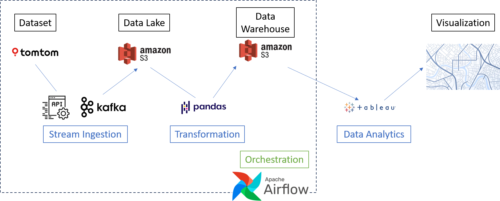
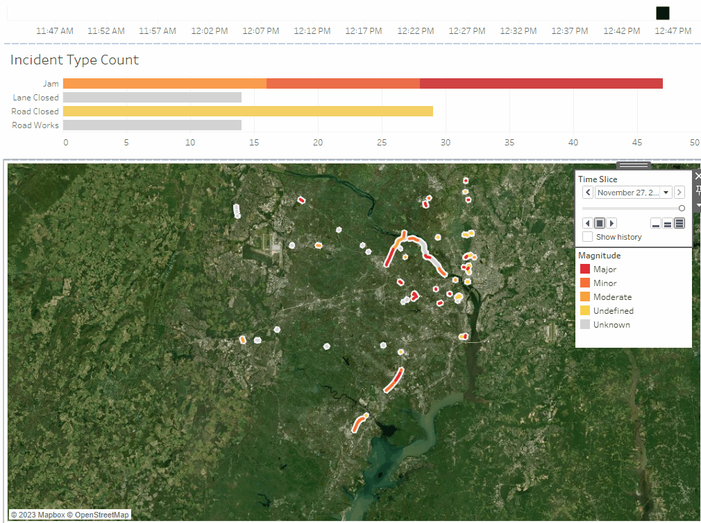
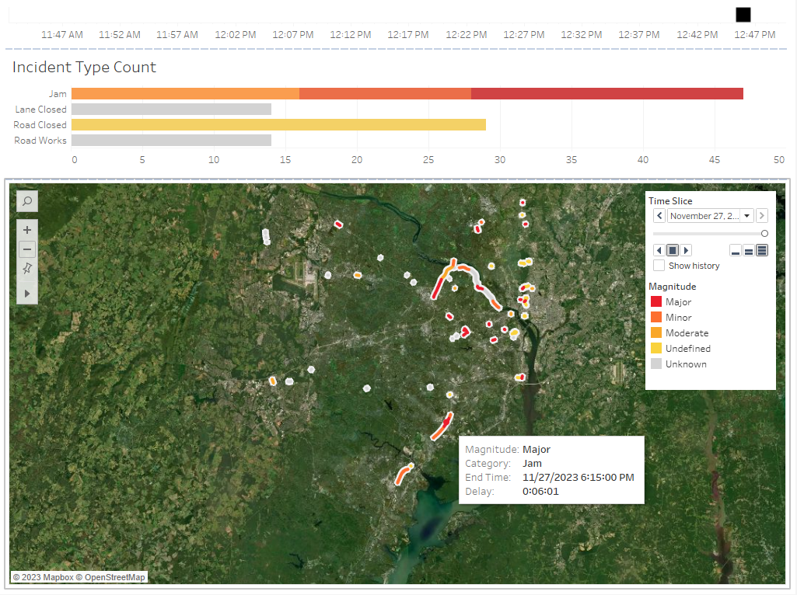

# Real Time Traffic Incident Visualization

by Michael Davies

## Project Function
The purpose of this project is to visualize real-time traffic incidents in the Northern Virginia area.
A frequent problem faced by both individual travelers and navigation applications is the unexpected nature and high-impact effect of traffic incidents. When a traffic incident occurs—be it roadwork, an accident, or a naturally occurring traffic jam—routes and arrival times can be significantly affected. The goal of this project is to solve the problem of identifying and analyzing these incidents by visualizing their location and impact in order to improve navigation planning.

## Dataset
This project uses TomTom traffic data as its dataset. The primary endpoint used is the Incident Details service, an endpoint within the Traffic Incidents service segment of the TomTom Traffic API. Incident Details is limited in geographical extent to 10,000 square kilometers. To remain within this limitation, the visualization will focus on the Fairfax/Arlington/Alexandria area of Northern Virginia and its immediate surroundings.

## Pipeline / Architecture
This project uses the Stream -> Visualization pipeline. The pipeline diagram in the Pipeline Infographic section below displays the tools and data flow used.

_Stream Ingestion:_ Data is ingested from the **TomTom Traffic API** Incident Details endpoint into an **Amazon S3** data lake. Data from the API calls is extracted and loaded using **Apache Kafka**.

_Transformation:_ Data is transformed from its raw state in the data lake to a cleaned version in preparation for analysis using the **pandas** Python library. Clean data is stored in an **Amazon S3** data warehouse in a location separate from the data lake.

_Data Analytics:_ CSV files from the data warehouse are downloaded locally to be visualized using **Tableau**.

_Orchestration:_ The pipeline, from ingestion through transformation, is orchestrated using **Apache Airflow**.

### Pipeline Infographic

## Data Quality Assessment
The quality of this dataset is high. The data conforms to expected formats and values for all fields, with no unrealistic outliers. Exploratory data analysis was performed using the included [EDA file](EDA.py). This script will also allow the generation of a data profile report of any JSON files generated during the ingest portion of the pipeline.

## Data Transformation
Because of the high quality of the dataset, transformation of ingested data fields proved unnecessary. The following additions were made during the transformation process in order to facilitate visualization:
- Renamed API fields for readability
- Added columns
  - Category names based on API documentation
  - Magnitude names based on API documentation
  - Delay duration in human readable time format
- Secondary exploded data set with one row for each geometry coordinate to enable map display

### Data Provenance
All data for this project originates from traffic information collected by TomTom via a combination of anonymous user GPS measurements, field surveys, aerial and satellite imagery, and mobile mapping vans. The result of this collection is an authentic, trustworthy dataset. Any changes to the data using this pipeline are cosmetic as described in this transformation section, using Python `pandas` dataframe manipulation. Changes are made in real time whenever new data is collected over the pipeline.

## Final Results
The final result of this project is a visualization of real time data collected and processed by the streaming pipeline. Below is the animation of the final dashboard for data generated between 11:46 and 12:47 on Monday, November 27th, 2023, in addition to a still image of the point in time 11/27/23 12:46 PM.

### Dashboard Animation

### Dashboard Snapshot

## Thorough Investigation
Based on the results of this prototype project, this method of data gathering and visualization for traffic incidents is a viable way to analyze traffic incidents over time. Three immediate options for scaling this project up and out are:
- Increase features extracted. The API allows retrieval of several fields not yet included in this project, such as more granular incident events, location names and road numbers, and future events (where predictable).
- Increase physical area. This project is currently limited to the geographical box bounded between latitudes 39.0585509 and 38.614582, and longitudes -77.539145 and -77.031028.
- Increase time of data gathering. This is the simplest scaling option: as long as the resources are available, increasing the `call_count` variable in the code will allow more time for each data gathering event.

This project is not radically innovative. Traffic incidents are a heavilty inspected area, especially with regard to their effect on travel times. The goal of this project is to offer new ways to explore this well known phenomenon.

The most interesting next step with this project would be to tighten the streaming pipeline such that as data is gathered, it is visualized in close to real time. There are several technical difficulties surrounding this proposition, primarily (1) transformation occurs after all streaming ingestion is complete, (2) manual intervention is required between data transformation and data analysis, and (3) Tableau Desktop does not allow automatic continuous session data updates without user action. Each of these problems would need to be solved as part of the next phase of the project.

## Code
To replicate this project, download the [repository](https://github.com/mad0324/TrafficIncidentDataPipeline) as a zip file by clicking **Code** above the list of files, then **Download ZIP**. Follow the instructions in the **Special Instruction** and **Replicating this Project** sections below.

## Special Instructions
In order to access the dataset, a TomTom developer API key is required. This key can be generated for free, with instruction on the [TomTom developer site](https://developer.tomtom.com/traffic-api/documentation/product-information/introduction#getting-started). From the TomTom site:
1. To get your API Key, you first need to be registered for the TomTom Developer Portal. If you don't have an account, no worries! Register / Sign in now before continuing.
1. Once you are registered, go to your Dashboard and locate the API Key that you would like to use (we've created the first one for you, it's called My First API Key).

The ["My First API Key"](https://developer.tomtom.com/user/me/apps) generated by these steps is sufficient to run this project.

## Replicating this Project

### Environment

In order to run this project, an environment must be set up matching the VTMIT ECE 5984 Amazon environment. This includes an Amazon EC2 instance and and Amazon S3 bucket.

### Code Modifications

The following changes must be made to point to the correct S3 locations:
- `produce.py`
  - change the `key` variable to match your API key from the Special Instructions section.
- `ingest.py`
  - change the `DIR` variable to point to your S3 data lake location.
- `transform.py`
  - change the `DIR_lk` variable to point to your S3 data lake location.
  - change the `DIR_wh` variable to point to your S3 data warehouse location.

### Step 1: Connect to EC2 Instance

Connect to your EC2 instance, making a note of the current IP address.

Update `produce.py` with this IP address in the kafka producer.

Update `ingest.py` with this IP address in the kafka consumer.

### Step 2: Start Container and Install Packages

Within your EC2 instance, spin up a docker container 

`$ docker run --rm -it --entrypoint bash -v /home/ubuntu/efs-mount-point/<username>/<id>/root:/root -p 8080-8131:8080 -p 9092-9143:9092 --name <id> <image-name-or-id>`

Install required packages

`$ pip install pandas-datareader`

`$ pip install requests`

### Step 3: Update Port Numbers

Open a new EC2 instance and retrieve the port numbers for your container

`$ docker ps`

Update `produce.py` with the 9XXX port number in the kafka producer.

Update `ingest.py` with the 9XXX port number in the kafka consumer.

### Step 4: Create DAG Files

Within your docker container, navigate to the airflow dags directory.

`$ cd airflow/dags`

Create files and copy into their contents from your local modified copies.

`$ sudo nano dag_stream.py`

`$ sudo nano ingest.py`

`$ sudo nano transform.py`

### Step 5: Start Airflow

Within your docker container, start airflow.

`$ airflow standalone`

Leave this EC2 instance running.

### Step 6: Update Kafka Settings

Open a new EC2 instance and update kafka settings.

`$ docker exec -it <id> bash`

`$ cd /home/kafka_2.13-3.5.0/`

`$ export KAFKA_HEAP_OPTS="-Xmx256M -Xms128M"`

Open `server.properties` and change line `#advertised.listeners=PLAINTEXT://0.0.0.0:9092` to be uncommented, and to use your IP and 9XXX port instead of `0.0.0.0:9092`.

`$ sudo nano config/server.properties`

### Step 7: Run Zookeeper

Start zookeeper.

`$ bin/zookeeper-server-start.sh config/zookeeper.properties`

Leave this EC2 instance running.

### Step 8: Run Kafka Broker

Open a new EC2 instance to start the kafka broker.

`$ docker exec -it <id> bash`

`$ cd /home/kafka_2.13-3.5.0/`

`$ bin/kafka-server-start.sh config/server.properties`

Leave this EC2 instance running.

### Step 9: Create Kafka Topic and Monitor Consumer

Open a new EC2 instance to create the kafka topic.

`$ docker exec -it <id> bash`

`$ cd /home/kafka_2.13-3.5.0/`

`$ bin/kafka-topics.sh --create --topic TrafficIncidents --bootstrap-server <ip>:<9XXX port> --replication-factor 1 --partitions 1`

(Optional) Run the kafka consumer to monitor consumer activity.

`$ bin/kafka-console-consumer.sh --topic TrafficIncidents --bootstrap-server <ip>:<9XXX port>`

### Step 10: Run DAG from Airflow

Launch the airflow GUI in a new browser window using your IP and 8XXX port number.

From within airflow, click to open the `traffic_stream_dag` DAG. Click the play button to run it.

After clicking the play button, run your `produce.py` locally to produce data.

This process will vary in length depending on the `interval` and `call_count` variables in `produce.py` and `ingest.py`. Default is one hour for 60 API calls.

### Step 11: Retrieve Data and Populate Dashboard

Navigate to the S3 data warehouse location. Download the two files, `clean_traffic_data.csv` and `clean_traffic_data_exploded.csv`. Save them to your local machine.

Open `TrafficIncidentVisualization.twb` in Tableau Desktop. Use **Connect to Data**, **Text File** to point to your CSV file locations. Run the dashboard animation using the Time Slice window play button on the Dashboard tab.
